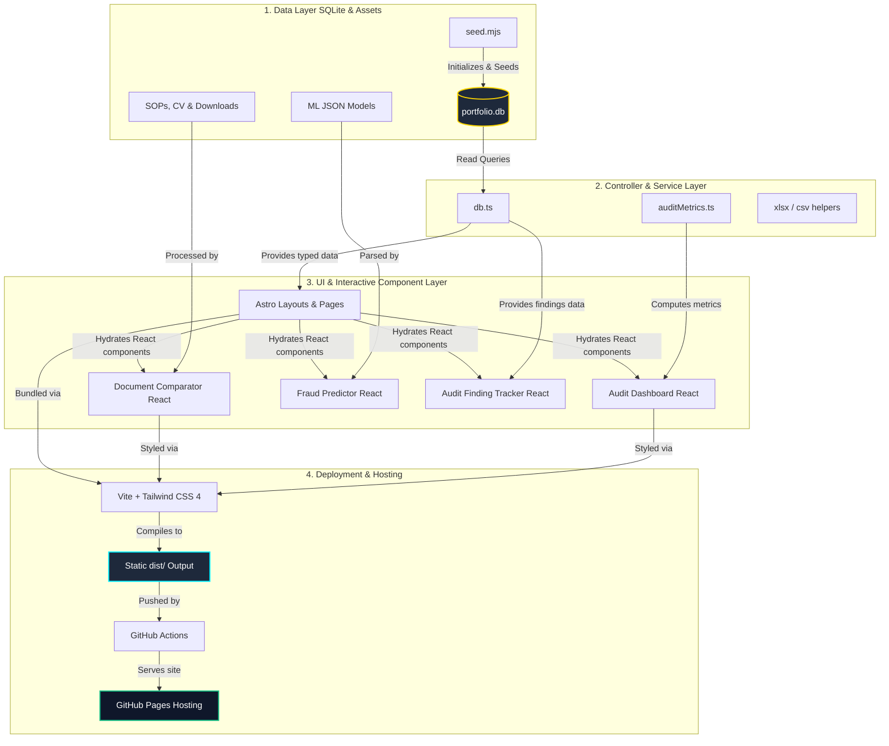
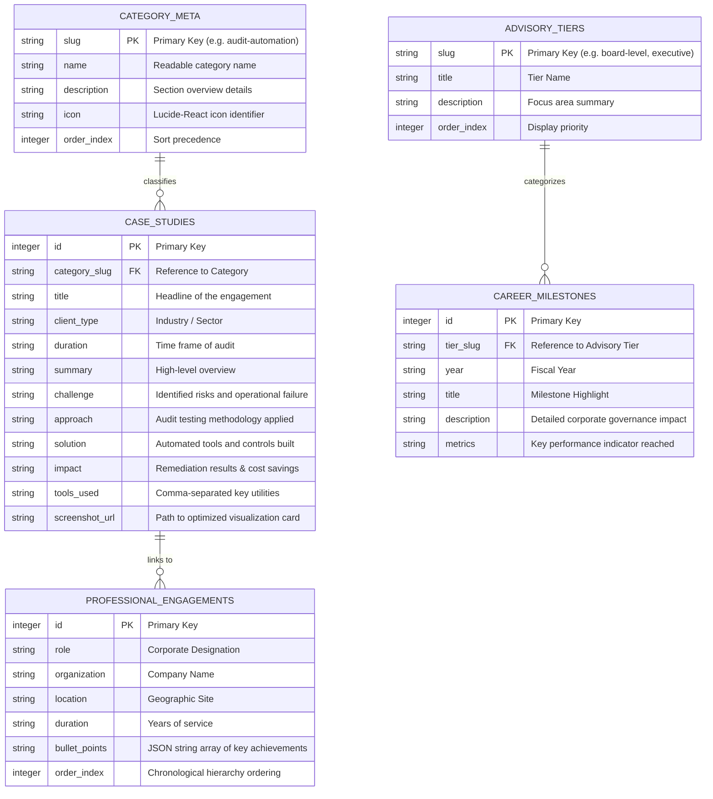
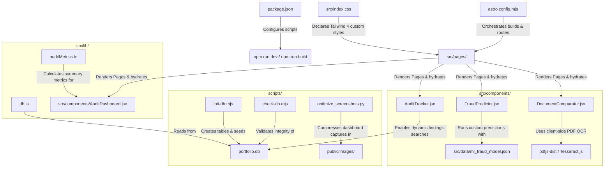

# 🕸️ Repository & Website Knowledge Graph
> **Interactive Architecture, Data Relationships, and Component Topology of the Executive Portfolio.**

This document provides a comprehensive **Knowledge Graph** mapping the software architecture, database relations, data pipelines, and component relationships of the Majid Mumtaz Executive Portfolio.

---

## 1. High-Level System Architecture

This website leverages **Astro 5** for static site generation (SSG) with **React 19** selective client-side hydration. The backend content layer is powered by **SQLite**, which compiles into static data stores during build time.

---

## 2. Entity-Relationship (ER) Schema

Most of the content rendered on the site is managed dynamically via an **SQLite database (`portfolio.db`)**. The database is fully relational and mapped in TypeScript.

---

## 3. Web Directory Map & Module Connectivity

The following graph maps directories, core scripts, and files to illustrate how they integrate together:

---

## 4. Technology Hierarchy & Interdependencies

The portfolio features nested dependencies which are critical to performance and bundle optimizations.

| Tier | Component Type | File / Path | Core Dependencies | Primary Role |
| :--- | :--- | :--- | :--- | :--- |
| **System** | Base Layout | `src/layouts/Layout.astro` | Astro Core, `src/index.css` | Site container, global SEO metadata, typography injection. |
| **Data** | Database Client | `src/lib/db.ts` | `better-sqlite3` | Instantiates SQLite connection and exports typed data queries. |
| **Data** | Metrics Engine | `src/lib/auditMetrics.ts` | Custom algorithms | Extracts metrics and computes standard deviation anomalies. |
| **Widget** | Audit Dashboard | `src/components/AuditDashboard.jsx` | `recharts`, `framer-motion` | Renders dynamic financial and operational audit visuals. |
| **Widget** | Doc Comparator | `src/components/DocumentComparator.jsx` | `pdfjs-dist`, `mammoth`, `xlsx` | Extracts text from formats and renders clean side-by-side diff. |
| **Widget** | Fraud Predictor | `src/components/FraudPredictor.jsx` | Dynamic form controls | Evaluates corporate threat indexes from user input. |
| **Page** | Dynamic Case Studies | `src/pages/projects/[id].astro` | DB client, `Layout.astro` | Dynamically generates detailed HTML case studies from SQLite. |

---

## 5. Deployment Lifecycle & Git Hooks

Understanding the automation flow from local development to production release:

1. **Local Working Copy:** Content edits are performed in `seed.mjs` and tested locally via `npm run dev`.
2. **Diagnostic Step:** Running `npm run db:check` and `npm run lint` guarantees database and TypeScript compiler safety.
3. **Commit Stage:** Commit messages follow semantic conventions as outlined in the guidelines.
4. **Push / CI Trigger:** On push, GitHub Actions spins up the build node, compiles TS/CSS, and bundles static assets into `dist/`.
5. **Deployment:** The production bundle is deployed automatically to GitHub Pages.
