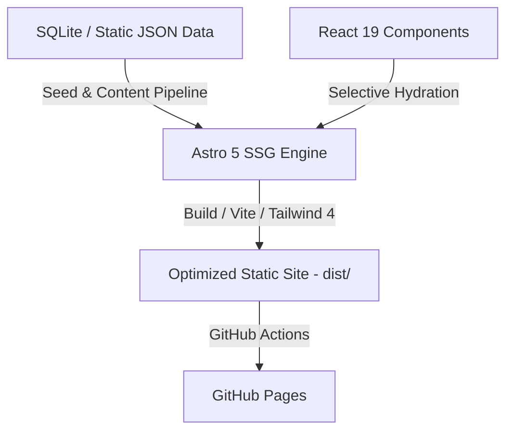

# 💼 Executive Portfolio — Majid Mumtaz
> **Director of Internal Audit & Risk Advisory**
> 
> *A high-performance, data-driven, and editorial-grade showcase of modern corporate governance, internal audit automation, fraud detection, and executive leadership.*

---

## 🌟 Overview

This repository houses the source code for the professional portfolio of **Majid Mumtaz**, Director of Internal Audit. Unlike static, text-heavy resumes, this platform is a state-of-the-art interactive tool designed to demonstrate real-world technical competency in audit automation, risk analytics, and forensic data analysis.

It is engineered with **Astro 5**, **React 19**, and **Tailwind CSS 4**, delivering near-instant page transitions, selective component hydration, dynamic interactive tools, and rich financial dashboards.

---

## 🏗️ Architecture & Core Tech Stack

The architecture utilizes a hybrid approach: **Static Site Generation (SSG)** for fast delivery and maximum SEO performance, combined with **Selective Client-Side Hydration** for high-fidelity React 19 widgets.



### 🛠️ Key Technologies
* **Framework:** [Astro 5](https://astro.build/) for modular layouts and blazing-fast static build delivery.
* **Interactive UI:** [React 19](https://react.dev/) powering dynamic data calculators, estimators, and visualizers.
* **Styling & Layout:** [Tailwind CSS 4](https://tailwindcss.com/) with a custom luxury-editorial design system (`editorial-panel`, `glass-card`, `frame-panel`).
* **State & Data Store:** [SQLite](https://www.sqlite.org/) via `better-sqlite3` for a database-first, easily-manageable content system.
* **Animation & Micro-Transitions:** [Framer Motion](https://www.framer.com/motion/) for fluid page entries and hover micro-animations.
* **Data Visualization:** [Recharts](https://recharts.org/) and [Observable Plot](https://observablehq.com/plot/) for forensic dashboards, risk indicators, and historical trendlines.
* **Specialized Libraries:**
  * **Text Extraction & Comparison:** `mammoth` (DOCX parsing) and `pdfjs-dist` (client-side PDF extraction).
  * **Forensic OCR:** `tesseract.js` for scanning digitized invoice audit logs.
  * **Spreadsheet Processing:** `xlsx` for direct client-side parsing of general ledger dumps.

---

## 🔬 Interactive Audit & Forensic Tools

The portfolio features custom-built, client-side tools that mimic real-world audit automation applications:

1. **Executive Audit Dashboard:** 
   * Dynamic analysis of mock audit cycles, testing results, control effectiveness, and risk heatmaps.
   * Leverages high-performance charting to allow executives to view interactive audit drill-downs.
2. **Internal Audit Tracker:**
   * An interactive finder tool querying structured findings by priority, severity, department, and remediation status.
3. **Advanced Document Comparator:**
   * Parses and diffs standard operating procedures (SOPs) against actual transaction logs or draft contracts in real-time.
   * Handles PDF, Word Document, and text extractions directly in the browser.
4. **Forensic ML Fraud Predictor:**
   * A client-side forensic tool that processes multi-dimensional transaction inputs (amount, frequency anomalies, authentication status) to determine risk probability.
   * Utilizes an offline random-forest/regression model mapped directly in JSON datasets (`src/data/`).

---

## 📂 Project Directory Structure

```text
portfolio_my/
├── .github/workflows/    # CI/CD deployment pipelines to GitHub Pages
├── public/               # Static assets (CV download, screenshots, official icons)
├── scripts/              # Automation and database maintenance scripts
│   ├── check-db.mjs      # Database integrity and structure verification
│   ├── init-db.mjs       # Creates and seeds the local portfolio.db from seed.mjs
│   └── *.py / *.R        # R/Python scripts for automated charts & screenshots
├── src/
│   ├── components/       # Reusable React & Astro UI components (Audit dashboards, models)
│   ├── data/             # Static reference datasets, ML JSON models, and asset mapping
│   ├── layouts/          # Editorial layouts, header systems, and typography shells
│   ├── lib/              # Core logic, database connectors, and audit metrics calculation
│   ├── pages/            # Astro route declarations (e.g., projects, case-studies, blog)
│   └── index.css         # Central CSS design system & Tailwind 4 tokens
├── tests/                # Standalone Node.js regression testing files
├── package.json          # Dependency registrations & operational scripts
├── astro.config.mjs      # Astro 5 configuration & integration ecosystem
└── portfolio.db          # SQLite Database (Local dev environment, Git-ignored)
```

---

## 🚀 Getting Started

Follow these steps to set up the executive portfolio in your local environment.

### 📋 Prerequisites
* **Node.js** (v18.x or v20.x recommended)
* **npm** (v10.x or higher)

### 💻 Installation

1. **Clone the Repository:**
   ```bash
   git clone https://github.com/majidrajpar/portfolio_my.git
   cd portfolio_my
   ```

2. **Install Dependencies:**
   ```bash
   npm install
   ```

3. **Initialize the Database:**
   This project is database-first. Most project case studies, timelines, and credentials reside in an SQLite database. Run this script to generate `portfolio.db` from standard seeds:
   ```bash
   npm run db:init
   ```

4. **Verify Database Integrity:**
   Ensure all tables, records, and static links are mapped correctly:
   ```bash
   npm run db:check
   ```

5. **Launch Local Development Server:**
   ```bash
   npm run dev
   ```
   Open your browser and navigate to `http://localhost:4321/` to view the running portfolio.

---

## 🛠️ Key CLI & Maintenance Commands

| Command | Action | Description |
| :--- | :--- | :--- |
| `npm run dev` | Dev Mode | Starts the Astro dev environment with HMR. |
| `npm run build` | Build Production | Bundles static pages, optimizes assets into `dist/`. |
| `npm run preview`| Local Staging | Runs a local server to preview the built `dist/` directory. |
| `npm run lint` | Code Quality | Validates syntax and styling integrity via ESLint. |
| `npm run db:init` | DB Reset | Re-seeds the local SQLite database from `seed.mjs`. |
| `npm run db:check` | DB Diagnostic | Tests connections and counts records inside `portfolio.db`. |

*Note: For regression tests on the text comparisons, run:*
```bash
node tests/document-comparator.test.js
```

---

## 🎨 Editorial Design Conventions

To maintain a luxury, corporate-executive aesthetic suited for a Board-level Director:
* **The Color Palette:** Uses curated dark HSL neutrals combined with deep navy accents and subtle gold/copper hover feedback. Avoid bright or flat saturated primaries.
* **Glassmorphism:** Styled cards use custom classes (`glass-card`, `frame-panel`) with thin borders (`border-white/10`) and backdrop filters (`backdrop-blur-md`).
* **Typography:** Rely on professional serifs and modern high-legibility geometric sans-serifs (like *Inter*, *Outfit*, or *Playfair Display*).
* **Database First:** Never hardcode text content or project descriptions inside `.astro` files. Modify `seed.mjs` and run `npm run db:init` to ensure clean migrations.

---

## 🚢 Continuous Deployment (CI/CD)

The portfolio features a fully automated deployment pipeline through **GitHub Actions** (`.github/workflows/deploy.yml`). 

Whenever a push is made to the `main` branch:
1. The action checks out the code, installs Node.js dependencies, and spins up a temporary database.
2. The Astro production builder compiling static files is triggered (`npm run build`).
3. The static output is deployed directly to **GitHub Pages** under [majidrajpar.github.io/portfolio_my](https://majidrajpar.github.io/portfolio_my/).

---

## 🔬 Research & Experiments

This repository also houses original research on AI audit judgement, conducted by Majid Mumtaz.

### Multi-Framework Audit Judgement Benchmark (`audit_bench_research/`)

A benchmark comparing four multi-agent orchestration frameworks (plain-Python Blackboard, CrewAI, OpenAI Swarm, LangGraph) on a shared audit-judgement task: four AI agents embodying canonical audit personas must form an audit opinion on four real-world corporate scandals (Enron, Wirecard, SVB, Tesco) using only pre-scandal public evidence. The paper was independently peer-reviewed by a second LangGraph multi-agent system, which identified a confound the deconfounding experiment then confirmed.

- **Discussion paper**: `audit_bench_research/audit_bench/DISCUSSION_PAPER.md` (~7,500 words)
- **Code**: `audit_bench_research/audit_bench/` (benchmark, frameworks, scorer, peer-review system)
- **Reports**: `audit_bench_research/audit_bench/RATING_REPORT.md`, `DECONFOUNDING_REPORT.md`
- **Private repo**: [github.com/majidrajpar/audit_bench_research](https://github.com/majidrajpar/audit_bench_research) (private; will be made public alongside the arXiv preprint)
- **Author**: Majid Mumtaz (ACCA, CIA, ACA)

---

## 👥 Profile & Contact

* **Executive Name:** Majid Mumtaz
* **Position:** Director of Internal Audit & Risk Advisory
* **LinkedIn:** [majid-m-4b097118](https://www.linkedin.com/in/majid-m-4b097118/)